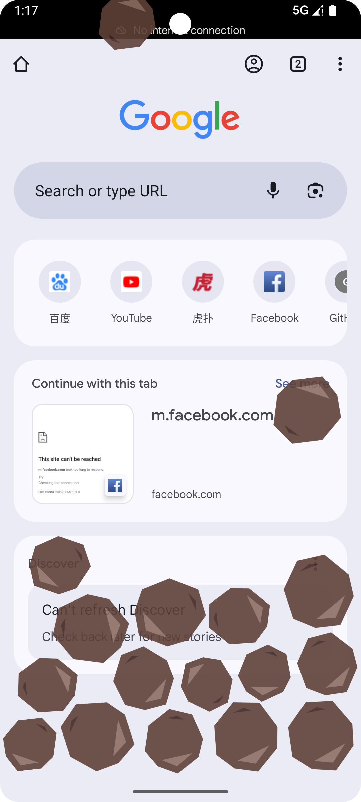

# Pebble (顽石) 🪨

> **夺回你的专注力，一块石头不够，就两块。**

Pebble 是一款基于物理引擎 (Box2D) 的 Android 防沉迷应用。与传统的强制锁机不同，Pebble 采用“物理干扰”的方式：当你沉溺于娱乐应用时，屏幕会不断掉落受重力控制的石头，它们会遮挡内容、互相碰撞，通过视觉干扰打破你的“无意识刷屏”行为。

## ✨ 核心功能 (v1.0)

* **物理干扰引擎**：集成 JBox2D 物理引擎，石头具有真实的重力、碰撞和滚动效果，晃动手机石头也会随之滚动。
* **黑名单管理**：自动扫描手机已安装应用，支持一键勾选需要“戒断”的 App（如短视频、游戏）。
* **智能监测**：使用 `UsageStats` 实时监测前台应用，配合动态时间窗口算法，精准识别且极低功耗。
* **MIUI/HyperOS 深度适配**：针对国产 ROM 激进的后台查杀策略进行了专门优化（前台服务保活、自启动引导）。
* **疗愈系 UI**：采用 "Healing Nature" 设计语言，米色与苔藓绿的配色，让戒断过程不再充满压力。

## 🛠️ 技术栈

* **语言**: Kotlin 2.0
* **UI 框架**: Jetpack Compose (Material3)
* **架构**: MVVM
* **数据库**: Room (保存配置与黑名单状态)
* **物理引擎**: JBox2D (Java port of C++ Box2D)
* **核心组件**:
    * `Accessibility/UsageStats`: 应用状态监测
    * `WindowManager`: 全局悬浮窗绘制
    * `ForegroundService`: 进程保活
    * `Coroutines & Flow`: 异步任务与响应式数据流

## 🚀 快速开始

### 安装要求
* Android 8.0 (API Level 26) 及以上
* 推荐开启“自启动”权限以获得最佳体验

### 权限说明
为了实现全局干扰，Pebble 需要以下敏感权限：
1.  **显示在其他应用上层 (悬浮窗)**：用于绘制掉落的石头。
2.  **访问使用记录**: 用于判断当前正在运行的是否为黑名单应用。

*注：Pebble 承诺不收集、不上传任何用户隐私数据，所有逻辑均在本地运行。*

## 📦 版本历史

### v1.0.0 (Initial Release)
- 完成核心物理掉落逻辑。
- 实现黑名单数据库存储。
- 完成 Jetpack Compose UI 重构。
- 修复小米设备上的后台查杀问题。

## 📄 许可证

[MIT License](LICENSE)